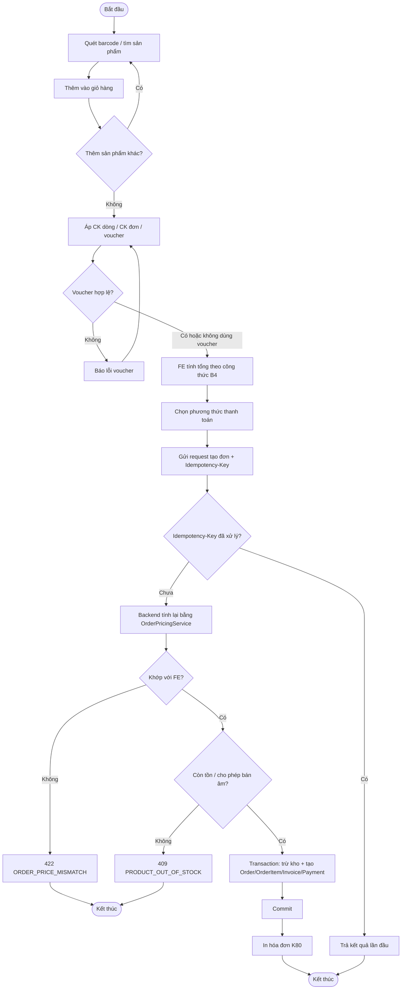
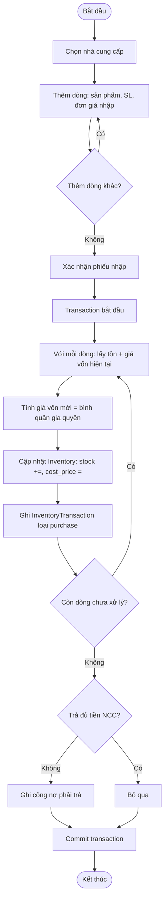
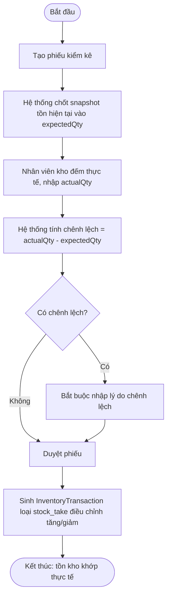
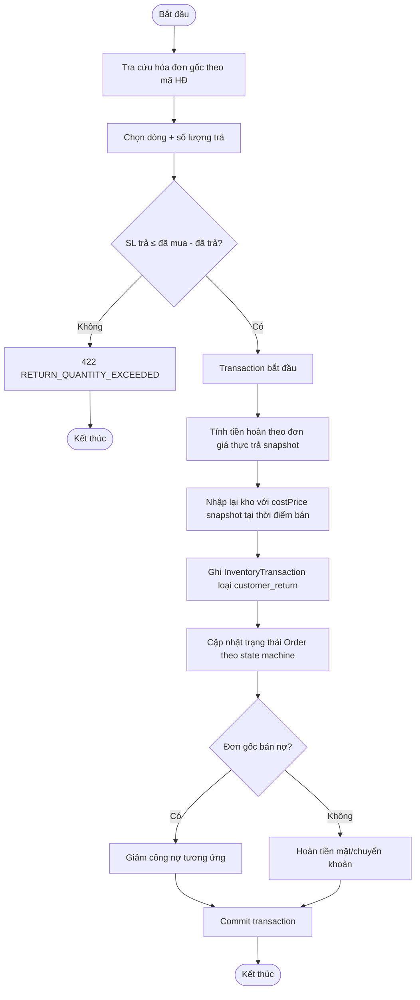

# Phase 1.4b — Activity diagram (Mermaid flowchart)

## 1. Bán hàng (POS)

```mermaid
flowchart TD
    Start([Bắt đầu]) --> Scan[Quét barcode / tìm sản phẩm]
    Scan --> AddCart[Thêm vào giỏ hàng]
    AddCart --> More{Thêm sản phẩm khác?}
    More -->|Có| Scan
    More -->|Không| Discount[Áp CK dòng / CK đơn / voucher]
    Discount --> VerifyVoucher{Voucher hợp lệ?}
    VerifyVoucher -->|Không| ShowError1[Báo lỗi voucher] --> Discount
    VerifyVoucher -->|Có hoặc không dùng voucher| CalcFE[FE tính tổng theo công thức B4]
    CalcFE --> ChoosePayment[Chọn phương thức thanh toán]
    ChoosePayment --> Submit[Gửi request tạo đơn + Idempotency-Key]
    Submit --> CheckIdempotent{Idempotency-Key đã xử lý?}
    CheckIdempotent -->|Có| ReturnCached[Trả kết quả lần đầu]
    CheckIdempotent -->|Chưa| Recalc[Backend tính lại bằng OrderPricingService]
    Recalc --> Match{Khớp với FE?}
    Match -->|Không| ErrMismatch[422 ORDER_PRICE_MISMATCH] --> End1([Kết thúc])
    Match -->|Có| CheckStock{Còn tồn / cho phép bán âm?}
    CheckStock -->|Không| ErrStock[409 PRODUCT_OUT_OF_STOCK] --> End1
    CheckStock -->|Có| TxStart[Transaction: trừ kho + tạo Order/OrderItem/Invoice/Payment]
    TxStart --> TxCommit[Commit]
    TxCommit --> Print[In hóa đơn K80]
    Print --> End2([Kết thúc])
    ReturnCached --> End2
```

## 2. Nhập kho

```mermaid
flowchart TD
    Start([Bắt đầu]) --> ChooseSupplier[Chọn nhà cung cấp]
    ChooseSupplier --> AddLine[Thêm dòng: sản phẩm, SL, đơn giá nhập]
    AddLine --> MoreLine{Thêm dòng khác?}
    MoreLine -->|Có| AddLine
    MoreLine -->|Không| Confirm[Xác nhận phiếu nhập]
    Confirm --> TxStart[Transaction bắt đầu]
    TxStart --> Loop[Với mỗi dòng: lấy tồn + giá vốn hiện tại]
    Loop --> CalcCost[Tính giá vốn mới = bình quân gia quyền]
    CalcCost --> UpdateInv[Cập nhật Inventory: stock +=, cost_price =]
    UpdateInv --> WriteTx[Ghi InventoryTransaction loại purchase]
    WriteTx --> NextLine{Còn dòng chưa xử lý?}
    NextLine -->|Có| Loop
    NextLine -->|Không| PayCheck{Trả đủ tiền NCC?}
    PayCheck -->|Không| WriteDebt[Ghi công nợ phải trả]
    PayCheck -->|Có| SkipDebt[Bỏ qua]
    WriteDebt --> Commit[Commit transaction]
    SkipDebt --> Commit
    Commit --> End([Kết thúc])
```

## 3. Kiểm kê kho

```mermaid
flowchart TD
    Start([Bắt đầu]) --> CreateStockTake[Tạo phiếu kiểm kê]
    CreateStockTake --> Snapshot[Hệ thống chốt snapshot tồn hiện tại vào expectedQty]
    Snapshot --> Count[Nhân viên kho đếm thực tế, nhập actualQty]
    Count --> CalcDiff[Hệ thống tính chênh lệch = actualQty - expectedQty]
    CalcDiff --> HasDiff{Có chênh lệch?}
    HasDiff -->|Có| RequireReason[Bắt buộc nhập lý do chênh lệch]
    HasDiff -->|Không| Approve
    RequireReason --> Approve[Duyệt phiếu]
    Approve --> AdjustInv[Sinh InventoryTransaction loại stock_take điều chỉnh tăng/giảm]
    AdjustInv --> End([Kết thúc: tồn kho khớp thực tế])
```

## 4. Trả hàng

```mermaid
flowchart TD
    Start([Bắt đầu]) --> LookupOrder[Tra cứu hóa đơn gốc theo mã HĐ]
    LookupOrder --> SelectItems[Chọn dòng + số lượng trả]
    SelectItems --> CheckQty{SL trả ≤ đã mua - đã trả?}
    CheckQty -->|Không| ErrQty[422 RETURN_QUANTITY_EXCEEDED] --> End1([Kết thúc])
    CheckQty -->|Có| TxStart[Transaction bắt đầu]
    TxStart --> CalcRefund[Tính tiền hoàn theo đơn giá thực trả snapshot]
    CalcRefund --> RestoreStock[Nhập lại kho với costPrice snapshot tại thời điểm bán]
    RestoreStock --> WriteReturnTx[Ghi InventoryTransaction loại customer_return]
    WriteReturnTx --> UpdateOrderStatus[Cập nhật trạng thái Order theo state machine]
    UpdateOrderStatus --> DebtOrCash{Đơn gốc bán nợ?}
    DebtOrCash -->|Có| ReduceDebt[Giảm công nợ tương ứng]
    DebtOrCash -->|Không| RefundCash[Hoàn tiền mặt/chuyển khoản]
    ReduceDebt --> Commit[Commit transaction]
    RefundCash --> Commit
    Commit --> End2([Kết thúc])
```
