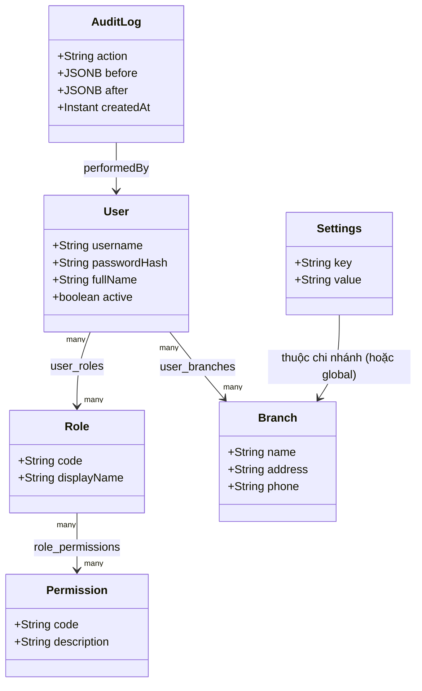
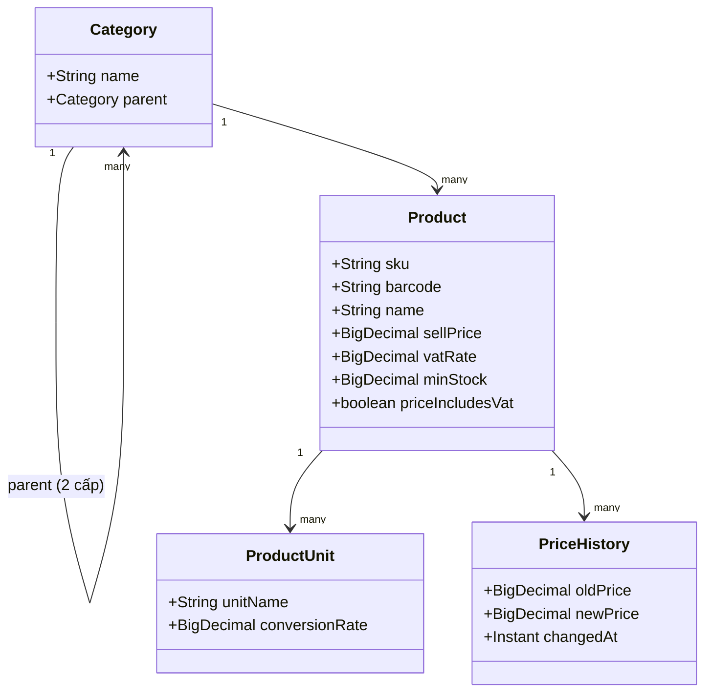
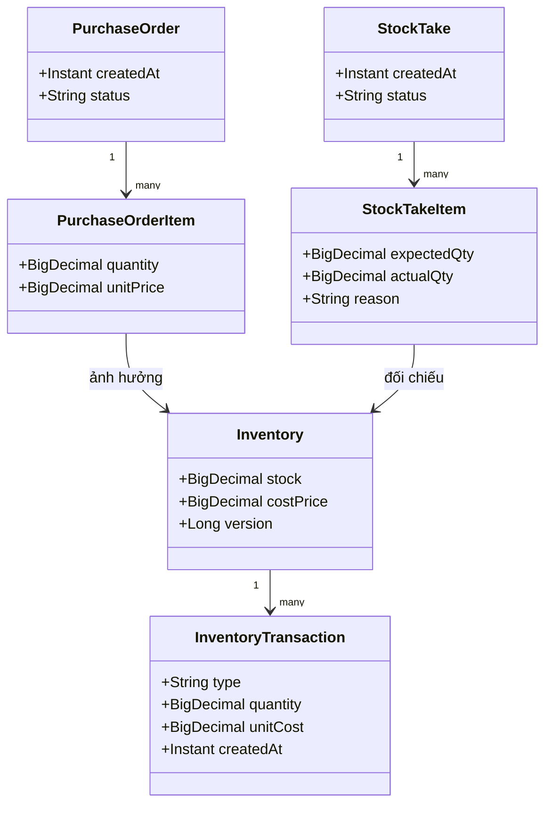
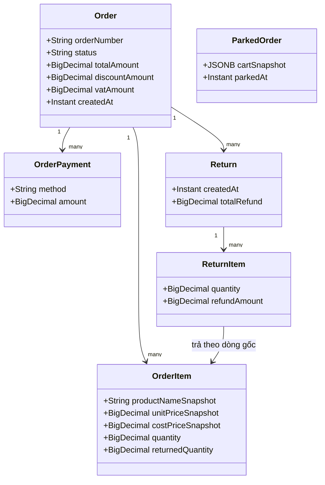
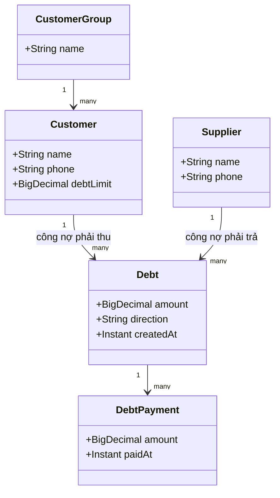
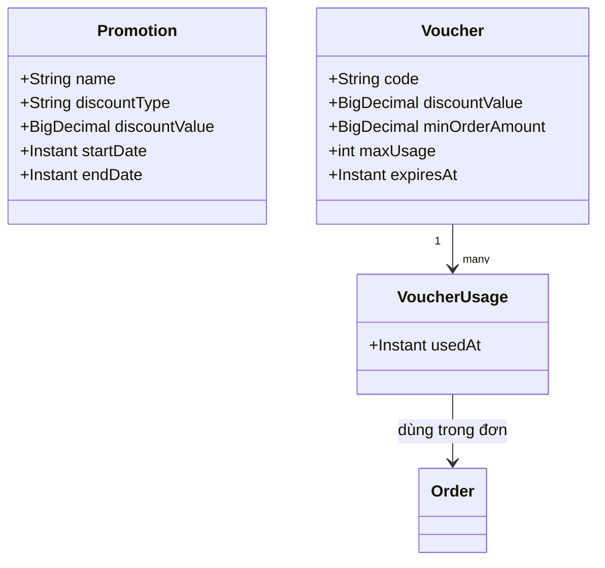
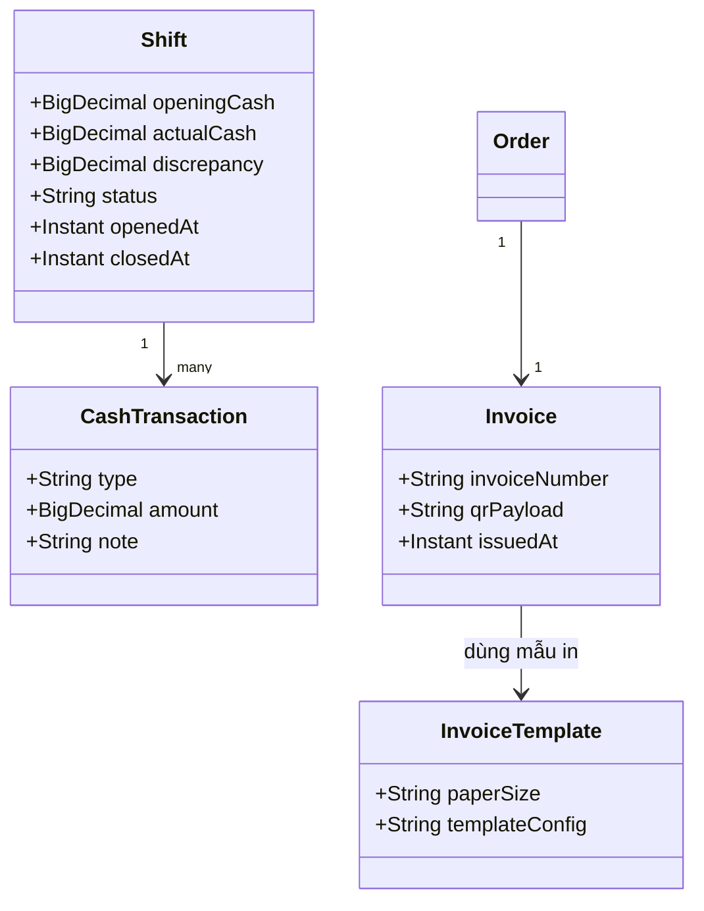

# Phase 1.5a — Class diagram domain

Đây là mô hình **nghiệp vụ** (domain), chưa phải Entity JPA (sẽ ánh xạ chi
tiết ở Phase 3 với `@Entity`, `@Column`, `@ManyToOne`...). Chia theo 7 nhóm
đúng danh sách bảng đã chốt ở B4/Phase 3 (~30 bảng). Do số lượng lớn, mỗi
nhóm vẽ riêng 1 diagram cho dễ đọc; quan hệ liên nhóm liệt kê ở bảng cuối.

## Nhóm 1 — Hệ thống

## Nhóm 2 — Sản phẩm

## Nhóm 3 — Kho

## Nhóm 4 — Bán hàng

## Nhóm 5 — Đối tác

## Nhóm 6 — Khuyến mãi

## Nhóm 7 — Vận hành

## Quan hệ liên nhóm (cross-group)

| Từ | Đến | Bản chất |
|---|---|---|
| `Order` | `Branch`, `User` (thu ngân), `Customer`, `Shift` | Đơn thuộc 1 chi nhánh, do 1 thu ngân tạo, có thể gắn khách hàng và ca làm việc |
| `OrderItem` | `Product` | Tham chiếu sản phẩm gốc, nhưng **snapshot** tên/giá/giá vốn — không tính lại từ Product khi hiển thị hóa đơn cũ (D5) |
| `Inventory` | `Product`, `Branch` | Khóa composite `productId + branchId` |
| `InventoryTransaction` | `Order`/`PurchaseOrder`/`StockTake`/`Return` | Nguồn gốc mọi biến động kho, tùy loại giao dịch (B4) |
| `PurchaseOrder` | `Supplier`, `Branch`, `User` | Phiếu nhập gắn NCC, chi nhánh, người tạo |
| `Debt` | `Customer` hoặc `Supplier` | Chiều nợ khác nhau tùy `direction` (phải thu / phải trả) |
| `Promotion`/`Voucher` | `Order` (qua `VoucherUsage`) | Áp dụng khi tạo đơn |
| `AuditLog` | Bất kỳ Entity nhạy cảm | Ghi qua AOP `@Aspect`, không gọi tay từng chỗ |

Tổng cộng đủ 7 nhóm / ~30 bảng theo danh sách đã chốt B4/Phase 3. Entity JPA
chi tiết (kiểu dữ liệu chính xác, `@Column(name=...)`, `@ManyToOne(fetch =
LAZY)`, `@Version`...) sẽ sinh ở Phase 3.
