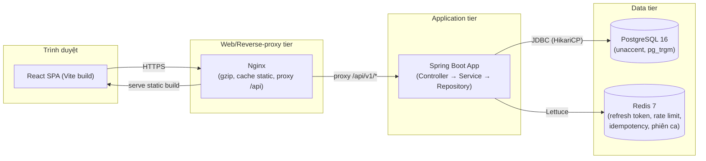
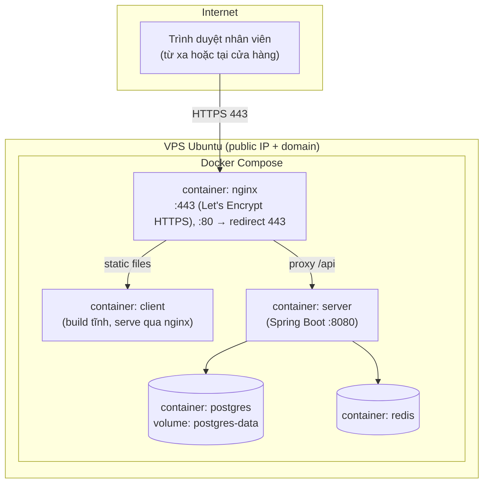
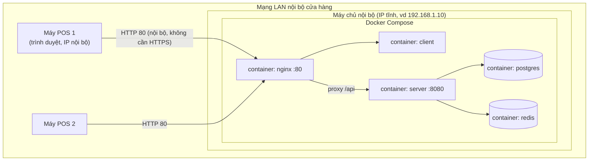

# Phase 1.5b — Component & Deployment diagram

> **Cần kiểm chứng**: Mermaid bản ổn định không có cú pháp `deploymentDiagram`
> chuẩn UML (chỉ có `C4Deploy` trong plugin mermaid-c4 ở một số bản, chưa
> chắc chắn có sẵn trong mọi phiên bản Mermaid mà dự án dùng). Dưới đây dùng
> `flowchart` với `subgraph` đại diện cho từng node vật lý — cách phổ biến
> và tương thích rộng nhất.

## Component diagram (logic, không phụ thuộc nơi deploy)

## Kịch bản triển khai 1 — VPS (Internet-facing)

**Đặc điểm**: có domain + chứng chỉ HTTPS (Let's Encrypt, certbot); truy cập
được từ bất kỳ đâu có Internet; cần cấu hình firewall (UFW) chỉ mở 80/443/22.

## Kịch bản triển khai 2 — Máy LAN nội bộ (không cần domain)

**Đặc điểm**: truy cập qua IP tĩnh nội bộ, không cần domain/HTTPS (mạng
riêng, không public ra Internet); firewall Windows/UFW chỉ cho phép các máy
trong dải IP LAN truy cập cổng 80; backup `pg_dump` định kỳ vẫn áp dụng như
kịch bản VPS.

## So sánh nhanh 2 kịch bản

| Tiêu chí | VPS | LAN nội bộ |
|---|---|---|
| HTTPS | Bắt buộc (Let's Encrypt) | Không cần (mạng riêng) |
| Domain | Cần | Không cần, dùng IP tĩnh |
| Truy cập từ xa | Có | Không (chỉ trong LAN, trừ khi VPN) |
| Chi phí vận hành | Thuê VPS hàng tháng | Chỉ 1 máy chủ tại chỗ, không phí thuê |
| Firewall | UFW mở 80/443/22 | UFW/Windows Firewall giới hạn theo dải IP LAN |
| Phù hợp | Cửa hàng muốn quản lý từ xa, nhiều chi nhánh | Cửa hàng đơn lẻ, ngân sách hạn chế |

Cả 2 kịch bản dùng chung 1 bộ `docker-compose.yml` + `.env` khác nhau (biến
môi trường `CORS_ALLOWED_ORIGINS`, có/không có Nginx cấu hình SSL) — chi
tiết Dockerfile/compose sinh ở Phase 12.
