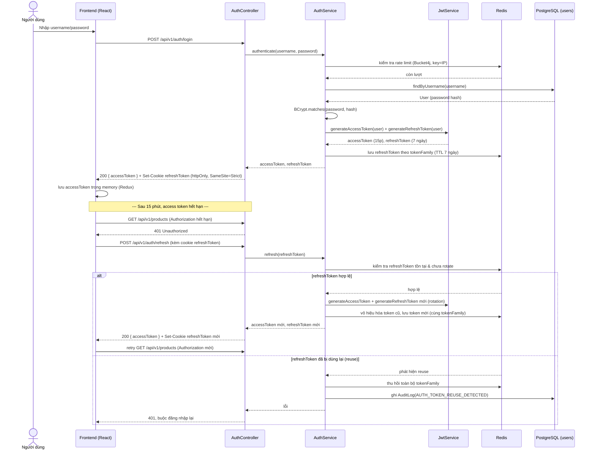
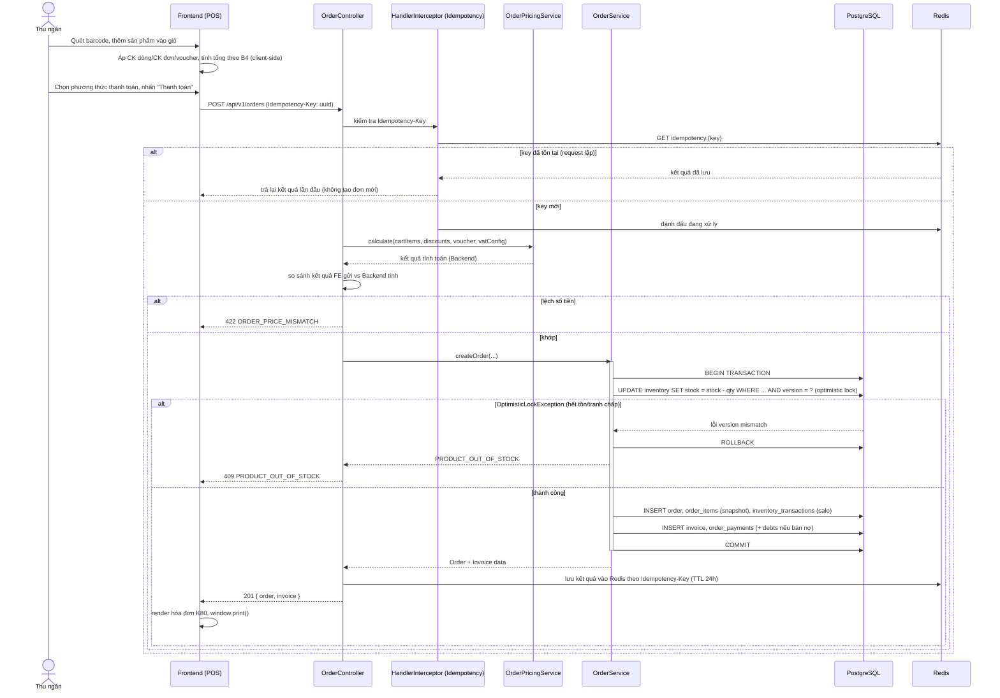
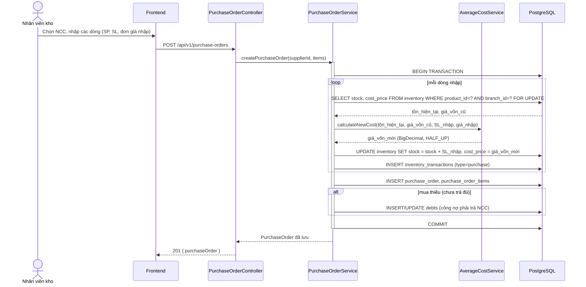
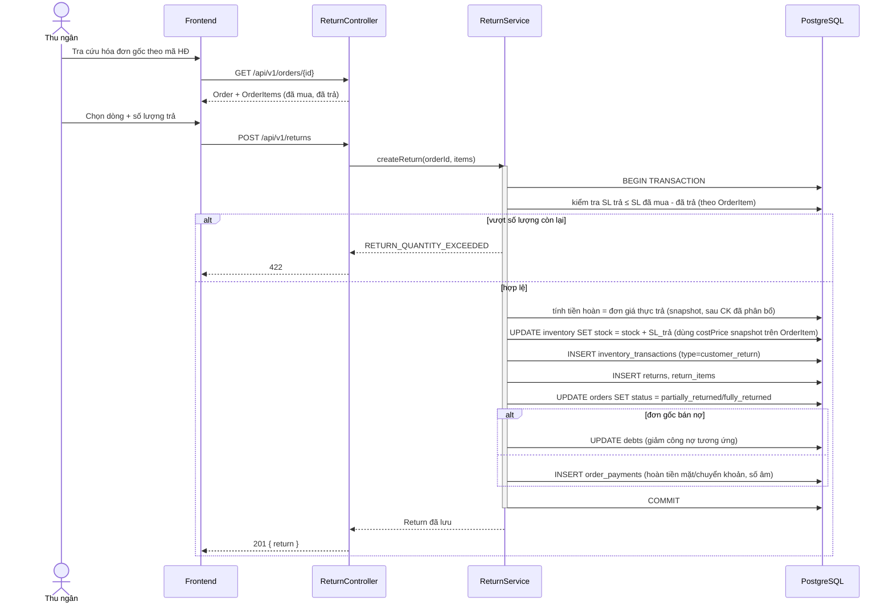
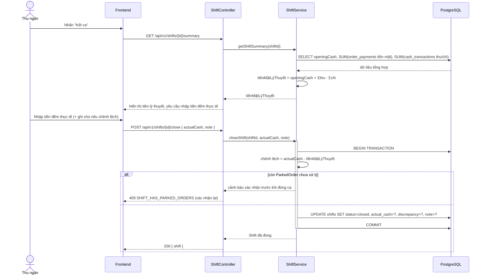

# Phase 1.4a — Sequence diagram (Mermaid)

## 1. Đăng nhập + Refresh token rotation

## 2. Bán hàng POS đầy đủ

## 3. Nhập kho (kèm tính lại giá vốn)

## 4. Trả hàng (khách hàng)

## 5. Kết ca

