# Phase 1.3b — Use case diagram

> **Cần kiểm chứng**: Mermaid (bản ổn định hiện hành) chưa có cú pháp
> `usecaseDiagram` chuẩn UML — chỉ có `flowchart`/`graph`, `classDiagram`,
> `sequenceDiagram`, `stateDiagram`, `erDiagram`... Cách phổ biến cộng đồng
> dùng thay thế là biểu diễn use case bằng node hình oval (`(( ))` hoặc
> `([ ])`) trong `flowchart`, actor bằng node chữ nhật. Nếu dự án nâng cấp
> Mermaid lên bản có hỗ trợ `usecaseDiagram` chính thức, nên đổi lại cú
> pháp chuẩn UML. Dưới đây dùng `flowchart LR` làm giải pháp thay thế.

```mermaid
flowchart LR
    Owner["Chủ cửa hàng"]
    Manager["Quản lý"]
    Cashier["Thu ngân"]
    Sales["Nhân viên bán hàng"]
    Warehouse["Nhân viên kho"]
    Accountant["Kế toán"]

    subgraph Auth["Xác thực"]
        UC01(("UC-01 Đăng nhập /\nRefresh / Đăng xuất"))
    end

    subgraph ProductMgmt["Sản phẩm"]
        UC02(("UC-02 Danh mục"))
        UC03(("UC-03 Sản phẩm"))
    end

    subgraph POS["Bán hàng POS"]
        UC04(("UC-04 Bán hàng POS"))
        UC11(("UC-11 Khuyến mãi / Voucher"))
        UC12(("UC-12 Trả hàng KH"))
        UC13(("UC-13 Hủy đơn"))
        UC18(("UC-18 Treo đơn"))
    end

    subgraph Inventory["Kho"]
        UC05(("UC-05 Nhập kho"))
        UC06(("UC-06 Tồn kho / thẻ kho"))
        UC16(("UC-16 Kiểm kê"))
    end

    subgraph Partner["Đối tác"]
        UC07(("UC-07 Khách hàng"))
        UC08(("UC-08 Nhà cung cấp"))
        UC14(("UC-14 Công nợ KH"))
        UC15(("UC-15 Công nợ NCC"))
    end

    subgraph InvoiceReport["Hóa đơn & Báo cáo"]
        UC09(("UC-09 In hóa đơn K80"))
        UC10(("UC-10 Báo cáo doanh thu"))
        UC17(("UC-17 Báo cáo lợi nhuận gộp"))
    end

    subgraph Shift["Vận hành"]
        UC19(("UC-19 Ca & két tiền"))
    end

    Owner --> UC01
    Manager --> UC01
    Cashier --> UC01
    Sales --> UC01
    Warehouse --> UC01
    Accountant --> UC01

    Manager --> UC02
    Manager --> UC03
    Warehouse --> UC03

    Cashier --> UC04
    Sales --> UC04
    Cashier --> UC11
    Sales --> UC11
    Manager --> UC11
    Cashier --> UC12
    Sales --> UC12
    Manager --> UC13
    Cashier --> UC18
    Sales --> UC18

    Warehouse --> UC05
    Manager --> UC05
    Warehouse --> UC06
    Manager --> UC06
    Accountant --> UC06
    Warehouse --> UC16
    Manager --> UC16

    Cashier --> UC07
    Sales --> UC07
    Manager --> UC07
    Warehouse --> UC08
    Manager --> UC08
    Manager --> UC14
    Accountant --> UC14
    Cashier --> UC14
    Manager --> UC15
    Accountant --> UC15

    Cashier --> UC09
    Sales --> UC09
    Manager --> UC10
    Accountant --> UC10
    Manager --> UC17
    Accountant --> UC17

    Cashier --> UC19
    Manager --> UC19

    Owner -.->|"toàn quyền (kế thừa mọi use case Manager)"| Manager
```

## Đặc tả use case nhóm MUST (bảng tóm tắt)

| Use case | Actor chính | Actor phụ | Tiền điều kiện | Kết quả chính |
|---|---|---|---|---|
| UC-01 Đăng nhập/Refresh/Đăng xuất | Mọi vai trò | — | Tài khoản active | Có phiên hợp lệ (access + refresh token) |
| UC-02 Danh mục sản phẩm | Quản lý | Chủ cửa hàng | `category:*` | Cây danh mục cập nhật |
| UC-03 Sản phẩm | Quản lý, NV kho | Chủ cửa hàng | `product:*` | Sản phẩm sẵn sàng bán ở POS |
| UC-04 Bán hàng POS | Thu ngân, NV bán hàng | — | `order:create`, còn tồn hoặc cho phép bán âm | Đơn `completed`, hóa đơn in được |
| UC-05 Nhập kho | NV kho | Quản lý | `purchase-order:create` | Tồn tăng, giá vốn tính lại đúng |
| UC-06 Tồn kho & thẻ kho | NV kho, Quản lý | Kế toán | `inventory:view` | Tồn kho + lịch sử biến động chính xác |
| UC-07 Khách hàng | Thu ngân, NV bán hàng | Quản lý | `customer:*` | Khách hàng sẵn sàng dùng ở POS |
| UC-08 Nhà cung cấp | NV kho | Quản lý | `supplier:*` | NCC sẵn sàng dùng ở nhập kho |
| UC-09 In hóa đơn K80 | Thu ngân, NV bán hàng | — | Đơn đã `completed` | Hóa đơn giấy khớp số liệu đơn gốc |
| UC-10 Báo cáo doanh thu | Quản lý, Kế toán | — | `report:revenue` | Số liệu doanh thu theo bộ lọc |

Ghi chú: đặc tả chi tiết đầy đủ (luồng chính/phụ/ngoại lệ/quy tắc) của nhóm
MUST nằm tại [`business-specs-must.md`](./business-specs-must.md); nhóm
SHOULD tại [`business-specs-should.md`](./business-specs-should.md).
