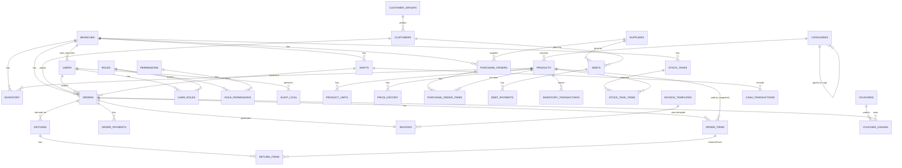

# Phase 3.1–3.2 — ERD & Chuẩn hóa dữ liệu

## ⚠️ Phát hiện mâu thuẫn trong Master Prompt gốc — đã xử lý

Phần B4 của Master Prompt yêu cầu đồng thời 2 điều **mâu thuẫn nhau** cho
cột `inventory.stock`:

1. "cấu hình `allow_negative_stock` cho phép bán âm"
2. "ràng buộc ở DB: cột `stock` có `CHECK (stock >= 0)` — tấm lưới an toàn
   cuối cùng"

Một `CHECK (stock >= 0)` tĩnh sẽ **luôn chặn** giá trị âm ở tầng DB, kể cả
khi cửa hàng bật `allow_negative_stock = true` — nghĩa là tính năng "cho
phép bán âm" sẽ không bao giờ hoạt động được nếu áp dụng đúng nghĩa đen cả
2 yêu cầu.

**Giải pháp áp dụng** (thay `CHECK` tĩnh bằng `TRIGGER` đọc cấu hình theo
chi nhánh): hàm `fn_check_inventory_stock()` chạy `BEFORE INSERT OR UPDATE`
trên `inventory`, đọc `settings.allow_negative_stock` theo `branch_id`
(hoặc cấu hình global nếu chi nhánh không có riêng); nếu `stock < 0` VÀ
cấu hình không cho phép → `RAISE EXCEPTION` (Service tầng Java bắt lỗi này
và map thành `PRODUCT_OUT_OF_STOCK`, giống hệt cách xử lý
`OptimisticLockException`). Đây vẫn là "tấm lưới an toàn cuối cùng ở DB"
đúng tinh thần B4, nhưng tôn trọng đúng cấu hình `allow_negative_stock`
thay vì chặn cứng. Đây là trade-off PostgreSQL-specific (PL/pgSQL) đã được
nêu trước ở Phần C ("cần quen thêm cú pháp PL/pgSQL nếu dùng
function/trigger").

## ERD tổng quan (Mermaid, `erDiagram`)

Được chia theo 7 nhóm B4/Phase 3 (~37 bảng, hơi nhiều hơn "~30" ước tính
ban đầu do bổ sung `user_branches` cho kiểm soát IDOR đa chi nhánh — Phase
1.1 quy tắc 4). `erDiagram` của Mermaid **có hỗ trợ chuẩn** (khác với
usecase/deployment ở Phase 1 không cần "cần kiểm chứng").

## 1. Chuẩn hóa 3NF

Toàn bộ bảng đạt 3NF: mỗi cột phụ thuộc hàm đầy đủ vào khóa chính, không
có phụ thuộc bắc cầu (transitive dependency). Ví dụ: `order_items` không
lưu `customer_name` (phụ thuộc vào `orders.customer_id`, không phải khóa
của `order_items`) — muốn biết tên khách phải join qua `orders` →
`customers`.

## 2. Denormalize có chủ đích (ngoại lệ 3NF, có lý do rõ ràng)

| Bảng.cột | Vì sao denormalize |
|---|---|
| `order_items.product_name_snapshot`, `unit_price_snapshot`, `cost_price_snapshot`, `vat_rate_snapshot` | **Snapshot bắt buộc** (D5): sửa `products.name`/`sell_price`/`vat_rate` sau khi đã bán không được làm sai lệch hóa đơn cũ. Đây không phải lỗi thiết kế — là yêu cầu nghiệp vụ cốt lõi (B4 edge case 2). |
| `inventory.cost_price` | Giá vốn bình quân gia quyền hiện tại — về lý thuyết có thể tính lại từ `SUM` trên `inventory_transactions`, nhưng lưu trực tiếp để tránh phải aggregate lại toàn bộ lịch sử mỗi lần đọc (D4 hiệu năng); giá trị này luôn được cập nhật đồng bộ trong cùng transaction với mỗi `inventory_transactions` mới (bất biến: `inventory.cost_price` luôn khớp kết quả tính từ lịch sử tại thời điểm hiện tại). |
| `orders.subtotal_amount/discount_amount/vat_amount/total_amount` | Lưu sẵn tổng đã tính thay vì luôn `SUM` từ `order_items` mỗi lần đọc — phục vụ báo cáo doanh thu (Phase 10) nhanh mà không cần join lại toàn bộ dòng. |
| `vouchers.used_count` | Đếm nhanh số lượt đã dùng (thay vì `COUNT(*)` trên `voucher_usages` mỗi lần verify voucher ở POS, nơi cần phản hồi < 300ms — D4). Đồng bộ tăng trong cùng transaction tạo `voucher_usages`. |
| `daily_sales_summary` (Phase 10, chưa tạo ở Phase 3) | Bảng tổng hợp báo cáo, cập nhật bằng `@Scheduled`, tránh tính aggregate nặng mỗi request (D4). |

## 3. `audit_logs.before`/`after` dùng JSONB thay vì TEXT

- **Truy vấn được**: JSONB cho phép `WHERE before->>'sellPrice' IS DISTINCT
  FROM after->>'sellPrice'` để tìm nhanh các thay đổi giá — TEXT phải parse
  ứng dụng mới lọc được.
- **Index được**: có thể thêm GIN index lên JSONB nếu sau này cần tìm
  kiếm sâu vào audit log, TEXT không hỗ trợ.
- **Không cần biết trước schema**: mỗi Entity có field khác nhau,
  JSONB linh hoạt lưu bất kỳ cấu trúc nào mà vẫn validate được là JSON hợp
  lệ (TEXT không đảm bảo điều này, có thể lưu chuỗi rác).
- **Đánh đổi**: JSONB nặng hơn TEXT một chút về dung lượng lưu trữ (metadata
  nhị phân) — chấp nhận được vì `audit_logs` không phải bảng truy vấn tần
  suất cao như `orders`.

## 4. Danh sách bảng theo 7 nhóm (thứ tự tạo bảng theo phụ thuộc FK, không theo thứ tự nhóm)

| # | Nhóm | Bảng |
|---|---|---|
| 1 | Hệ thống | `branches`, `users`, `roles`, `permissions`, `role_permissions`*, `user_roles`*, `user_branches`*, `settings`, `audit_logs` |
| 2 | Sản phẩm | `categories`, `products`, `product_units`, `price_history` |
| 3 | Kho | `inventory`, `inventory_transactions`, `purchase_orders`, `purchase_order_items`, `stock_takes`, `stock_take_items` |
| 4 | Bán hàng | `orders`, `order_items`, `order_payments`, `returns`, `return_items`, `parked_orders` |
| 5 | Đối tác | `customer_groups`, `customers`, `suppliers`, `debts`, `debt_payments` |
| 6 | Khuyến mãi | `promotions`, `vouchers`, `voucher_usages` |
| 7 | Vận hành | `shifts`, `cash_transactions`, `invoices`, `invoice_templates` |

`*` = bảng join thuần túy (`role_permissions`, `user_roles`,
`user_branches`) — không có Entity Java riêng, ánh xạ trực tiếp qua
`@ManyToMany` + `@JoinTable` trên `User`/`Role` (Phase 3.4).

## 5. Index bắt buộc (D4)

- Mọi cột FK có index (tự động qua `UNIQUE` composite nếu trùng, hoặc
  `CREATE INDEX` riêng).
- Composite: `orders(created_at, branch_id, status)`,
  `inventory_transactions(product_id, created_at)`.
- Unique: `products.sku`, `products.barcode`, `users.username`,
  `vouchers.code`, `orders.order_number`, `invoices.invoice_number`,
  `invoices.order_id`, `inventory(product_id, branch_id)`.
- GIN cho tìm không dấu: `products` — `unaccent(lower(name)) gin_trgm_ops`
  (B3).

Chi tiết đầy đủ SQL tại
[`server/src/main/resources/db/migration/V1__init_schema.sql`](../../server/src/main/resources/db/migration/V1__init_schema.sql).
