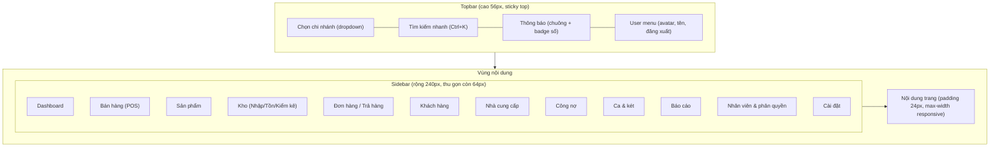
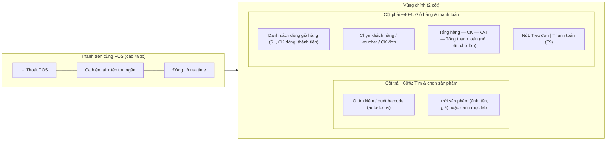

# Phase 4.2 — Layout

## Layout chính (mọi trang trừ POS): Sidebar + Topbar

**Hành vi**:
- Sidebar thu gọn (chỉ icon) trên màn hình < 1280px hoặc khi bấm nút
  toggle; trên mobile (< 768px) sidebar ẩn hoàn toàn, mở bằng hamburger
  menu overlay.
- Menu item chỉ hiển thị nếu user có ít nhất 1 quyền `view` trong nhóm đó
  (`<PermissionGate>` — Phase 5.3) — không hiển thị mục "Nhân viên & phân
  quyền" cho `cashier`/`sales_staff`/`warehouse_staff`.
- Route `/pos` **không** dùng layout này — chuyển sang POS layout riêng
  (mục dưới) ngay khi vào, ẩn sidebar/topbar để tối đa vùng thao tác.

## POS Layout (toàn màn hình, độc lập)

**Lý do 2 cột (không phải 3 cột hay xếp dọc)**: thu ngân cần nhìn đồng
thời sản phẩm đang chọn (trái) và tổng tiền cập nhật realtime (phải) mà
không cuộn trang — tối ưu cho thao tác nhanh, tay trái quét barcode/click
chuột, mắt theo dõi cột phải để đọc số tiền cho khách. Chi tiết đầy đủ tại
[`pos-design.md`](./pos-design.md).
